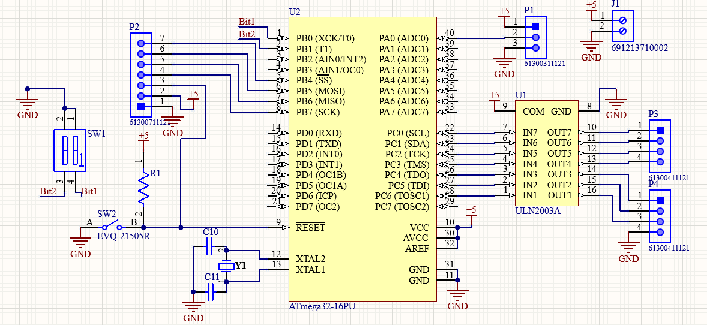
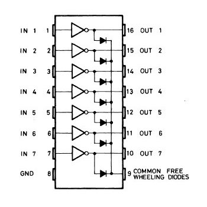

# Stepper-Driver-using-Assembly


## Table of contents

- [Quick start](#Quick-start)
- [Project Description](#Project-Description)
- [Used hardware components](#Used-hardware-components)
- [Used software tools](#Used-software-tools)
- [Programing languages used](#Programing-languages-used)
- [Components discription](#Components-discription)
- [Team members](#Team-members)

## Quick start

- in order to run the [circuit](https://github.com/seif-1999/Stepper-Controller-using-Assembly) you have to install at least proteus version 7. 
- Clone the repo: `git clone https://github.com/seif-1999/Stepper-Controller-using-Assembly.git`


## Project Description:
- Stepper motor is a brushless DC motor that divides the full rotation angle of 360° into a number of equal steps.
- The motor is rotated by applying a certain sequence of control signals. 
- The speed of rotation can be changed by changing the rate at which the control signals are applied.
- The rotation angle can be controlled by a potentiometer.
- Various stepper motors with different step angles and torque ratings are available in the market.
- A microcontroller can be used to apply different control signals to the motor to make it rotate according to the needed  application.
- This project shows how to create a stepper motor controller using AVR microcontroller and program it using assembly.


## Used hardware components:
- Bipolar / Unipolar Stepper Motor (200 steps, 1.8 degree/step)
- Atmega32 microcontroller (AVR Architecture)
- Potentiometer
- ULN2003A (driver)
- 5V boost converter
- 3.7V Li-ion battery
- 2-pin DIP switch
- 8 MHz crystal oscillator
- Miscellaneous connectors
## Used software tools:
- Atmel Studio 7.0 (Microchip Studio)
- Altium designer (CAD for PCB design)
- Proteus 7.7

## Programing languages used:
- Assembly (AVR instruction set)

## Components discription

### PCP Schematic

 <br> <br>
<div style="display:inline-block; ">
  <span style="width:74%;float:left; display:inline-block;">
<p>
  <ul>
    <li> 
  <br> <br> <br>
  </li>
  </ul>
</p>
  </span>
  
</div>

  <br> <br>
  <hr> 

### Stepper motor
 <br> <br>
<div style="display:inline-block; ">
  <span style="width:74%;float:left; display:inline-block;">
<p> 
  - DC motor that move in discrete steps giving the illusion of rotation </br>
  - It divides the complete rotation into number of steps ,Each stepper motor will have fixed step angle</br>
  - This motor is drived by ULN2003A (Darlington array)</br>
  - Stepper motors are basically two types :Unipolar & bipolar
  <ul>
    <li><h5>unipolar :- </h5> Has 5 or 6 wires ,this happens by tying each 2 coils from one end 
then there are 2 common wires as shown  , unipolar can be used as bipolar 
as we did in the project. </li>
  <li><h5>Bipolar :- </h5> Has only 4 wires comming out from two coils ,there is no common wires , it can't be used as unipolar </li>
  </ul>
</p>
  </span>
  
</div>

  <hr>
  
 ### Atmega32 microcontroller (AVR Architecture)
<br>
<div style="display:inline-block; ">
  <span style="width:74%;float:left; display:inline-block;">
<p>
  
 - ATmega32 is a powerful microcontroller because of its in system self programmable flash on a monolithic chip.
 - Provides a high flexible and cost effective solution to many embedded control applications.
  
  #### CPU

- 8-bit AVR
- Number of Pins: 40
- Operating Voltage (V): +4.5 to +5.5 V (+5.5V being absolute maximum)
- Number of I/O pins: 32
- Communication Interfaces: 
      * JTAG Interface(24,25,26,27 PINS)[Can be used for programming this controller] 
      * Master/Slave SPI Serial Interface(5,6,7,8 PINS) [Can be used for programming this controller]
      * Programmable Serial USART(14,15 PINS) [Can be used for programming this controller]
      * Two-wire Serial Interface(22,23 PINS)[Can be used to connect peripheral devices like sensors and LCDs]
- ADC Module: 8 channels , 10-bit resolution ADC
- Timer Module: Two 8-bit counters, One 16-bit counter [Total three]
- Analog Comparators: 1
- DAC Module: Nil
- PWM channels: 4
- External Oscillator: 0-8MHz for ATMEGA32L / 0-16MHz for ATMEGA32
- Internal Oscillato: 0-8MHz  Calibrated Internal Oscillator
- Program Memory Type: Flash
- Program Memory (KB): 32Kbytes[10000 write/erase cycles]
- Max CPU Speed (MIPS): 16 MIPS
- RAM Bytes: 2KBytes
- Data EEPROM: 1024 Bytes
- Watchdog Timer: Programmable Watchdog Timer with Separate On-chip  Oscillator
- Power Save Modes: Six Modes[Idle, ADC Noise Reduction, Power-save, Power-down, Standby and Extended Standby]
- Operating Temperature : -55°C to +125°C(+125 being absolute maximum, -55 being absolute m
#### In this project we used
    - ADMUX, ADCSRA registers to control and conifgure ADC.
    - PORTC, DDRC registers to control the stepper motor.
    - PORTB, DDRB, PINB to receive input from DIP switch inorder to control the operation mode.  
  <ul>
</p>

  </span>
  
</div>
### Potentiometer
<br> 
In this way we control the position of Motor (rotation angle) by changing the position of the potentiometer, a range between 0-5V (0-255) can be obtained through the potentiometer by using ADC converter to convert the analog value (0-5V) of the potentiometer to digital value (0-255) and the result is mapped to position (step 0-200), the target position will be subtracted from motor current position to determine the direction and number of stepps to move, and the reminder of target position divided by 4 will be used to determine the appropriate step sequence.

### ULN2003A (driver)
<br> <br> 
<div style="display:inline-block; ">
  <span style="width:24%;float:left; display:inline-block;">
<p>
- The ULN2003A is an array of seven NPN Darlington transistors.
- It features common-cathode flyback diodes for switching inductive loads. It can come in PDIP, SOIC, SOP or TSSOP packaging.
- The ULN2003A and is high voltage, high current Darlington arrays
- Each containing seven open collector common emitter pairs.
- Each pair is rated at 500mA. 
- Suppression diodes are included for inductive load driving, the inputs and outputs are pinned in opposition to simplify board layout.
  
  <ul>
    <li>
  
  </li>
</ul>
</p>
  </span>
  
</div>

  <hr>
  ### 5V boost converter
<br> <br><br> <br>
<div style="display:inline-block; ">
  <span style="width:74%;float:left; display:inline-block;">
<p>

  
  <ul>
       
- 18650 Lithium Charge & Discharge Integrated Li-ion Battery 2A 5V With Battery Level Indicator

- Charging voltage: DC4.5V-5.5V (recommended DC5V)
- Charging current: 0-2.1A
- Full voltage: 4.2V ± 1%
- Discharge current: 0-3.5A

- Discharge efficiency: up to 96%
- Output voltage: 5V
- Output current: 0-2.1A

- Overcurrent protection (OCP)
- Overvoltage protection (OVP)
- Short circuit protection (SCP)
- Over temperature protection (OTP)
    <li> 
  
  </li>
  </ul>
</p>
  </span>
  
</div>

  <hr>
  ### Li-ion battery

 <br> <br>
<div style="display:inline-block; ">
  <span style="width:74%;float:left; display:inline-block;">
<p>

</p>
  </span>
  
</div>

  <hr>
  
  ### 2-pin DIP switch
 <br> <br>
<div style="display:inline-block; ">
  <span style="width:74%;float:left; display:inline-block;">
<p>

  
</p>
  </span>
  
</div>

  <hr>
  
  ### 8 MHz crystal oscillator
    <br> <br>
<div style="display:inline-block; ">
  <span style="width:74%;float:left; display:inline-block;">
<p>

  
  <ul>
- A crystal oscillator is an electronic oscillator circuit that uses the mechanical resonance of a vibrating crystal of piezoelectric material to create an electrical signal with a constant frequency (in this project, an 8MHz crystal is used).
- Acts as the clock source for the microcontroller.
    
  </ul>
</p>
  </span>

</div>

  <hr>
  
  
  ### Miscellaneous connectors
 <br> <br>
<div style="display:inline-block; ">
  <span style="width:74%;float:left; display:inline-block;">
<p>

 </p>
  </span>
  
</div>

  <hr>
  

  

 ## Modes of operation
- There is 4 modes of operation (0, 1, 2, 3), those can be determined depending on the values of register PINB whose value is chosen by selecting different configuration form DIP switch 1, where 00 = mode0, 01 = mode1, 10 = mode2, 11 = mode2.
- This section of code reads PINB register and determine which mode to select.
 
 
 ```
  ; Check mode at the beining of each cycle


		in Mode, PINB			; Read PortB actual values in Mode  
		andi Mode, 3

		cpi Mode, 0				; Subtract 0 from mode to compare with 0
		breq mode3				; if Sw == 00 jump to mode 3

		cpi Mode, 1
		breq mode2				; if Sw == 01 jump to mode 2

		cpi Mode, 2 
		breq mode1				; if Sw == 10 jump to mode 1
	
		cpi Mode, 3
		breq mode0				; if Sw == 11 jump to mode 0
 
 ```
### Mode0
- In this mode we basically do nothing, just turn off all motor coils to preserve power.

 ```
;*************************************************Mode0****************************************
mode0:
								; Mode0: do nothing
		clr r16
		out PORTC, r16			; turn all coils off
		rjmp start
;**********************************************************************************************

 
 ```
### Mode1
- In this mode the motor moves one complete rotation forward at Full steps and one complete rotation reverse at Full step.


 ```
;*************************************************Mode1****************************************

mode1:							; Mode1: Full stepping
								; X steps forward at speed ?, then Y steps reverse at speed?

		ldi r29, 20				; Intialize a counter

forwardStep:

		in Mode, PINB			; Read PortB actual value to make sure no change in mode occured
		andi Mode, 3			; mask to read only the first two bits of PINB register

		subi Mode, 2			; If Mode is changed,
		brne start				; Jump to "Start"
		
		rcall  FullStep			; If Mode is not changed, proceed with current mod
		
		dec r29					; Decrement Steps counter
		brne forwardStep		; Repeat till X steps is done

		ldi r29, 20				; Intialize counter for reverse steps

reverseStep:

		in Mode, PINB			; Read PortB actual value to make sure no change in mode occured
		andi Mode, 3			; mask to read only the first two bits of PINB register
		 
		subi Mode, 2			; If Mode is changed (!= 2),
		brne start				; Jump to "Start"

		rcall FullStepReverse	; If Mode is not changed, proceed with current mode
		
		dec r29				; Decrement Steps counter
		brne reverseStep		; Repeat till Y steps is done
		
		rjmp start				; Jump to the start of the main loop when done
		
;**********************************************************************************************

 
 ```
### Mode2
- This mode is very close to mode1 except that it uses Half step increments.


 ```
;*************************************************Mode2****************************************

mode2:							; Mode2: Half Stepping
								; X half steps forward at speed ?, then Y half steps reverse at speed?

		ldi r29, 20				; Intialize a counter

forwardHalf:

		in Mode, PINB			; Read PortB actual value to make sure no change in mode occured
		andi Mode, 3			; mask to read only the first two bits of PINB register

		subi Mode, 1			; If Mode is changed (!== 1),
		brne start				; Jump to "Start"
    
		rcall  HalfStep			; If Mode is not changed, proceed with current mode
		dec r29					; Decrement Steps counter
		brne forwardHalf		; Repeat till X steps is done

		ldi r29, 20				; Intialize a counter

reverseHalf:

		in Mode, PINB			; Read PortB actual value to make sure no change in mode occured
		andi Mode, 3			; mask to read only the first two bits of PINB register
		subi Mode, 1			; If Mode is changed (!== 1),
		brne start				; Jump to "Start"

		rcall HalfStepReverse	; If Mode is not changed, proceed with current mode
		dec r29					; Decrement Steps counter
		brne reverseHalf		; Repeat till Y steps is done

		rjmp start				; Jump to the start of the main loop when done
		
;**********************************************************************************************


 ``` 
### Mode3
- This mode read the potentiometer value (0-5V) using an ADC to convert it a digital represnted range (0-255).
- The digital reprsented range (0-255) is then mapped to range of position in terms of steps (0-200) to determine the target position of the motor.


 

 ```
****************Mode3*************  

mode3:							; Mode3: Control Position with a Potentiometer


		rjmp  posAdjst			;Jump to posAdjst subroutine to calculate and move to target postion


 ```
## Team members
- [Seif El-Din Ehab](https://github.com/seif-1999)
- [Amina Farouk](https://github.com/aminafarouk1)
- [Rowan Mohamed Naguib](https://github.com/rowannaguib)
- [Ahmed Mohamed Sayed Tolba](https://github.com/ahmedtolba06)
- [Seif-Eldin Ragab](https://github.com/Seifeldin5)
 
